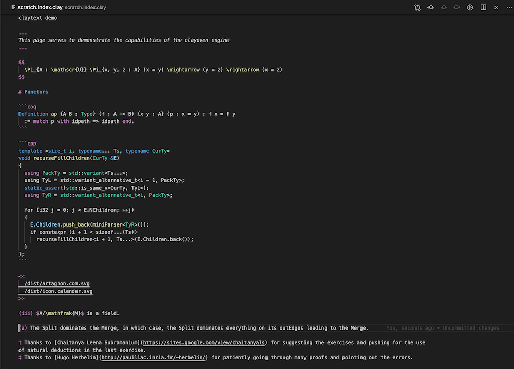

# clayoven 

[](https://codeclimate.com/github/artagnon/clayoven)

clayoven is a beautiful website generator with a carefully curated set of features. It has been built at a glacial pace, over a period of [seven years](https://github.com/artagnon/clayoven/commit/d4d40161e9f76dbe74078c669de9af698cf621d6), as [my website](https://artagnon.com) expanded in content. I have a spread of mathematical notes, software-related posts, and even some wider-audience [articles](https://artagnon.com/articles); it suffices to say that clayoven is good on all three fronts. The source files are written in "claytext", a custom format built for elegance and speed.

## The claytext format

Here's an excerpt of claytext, illustrating the main features. I've chosen to use a picture, because syntax highlighting is implemented in vscode, but not in `linguist`.



## The site-generation engine

All site content is split up into "topics", to put in the sidebar, each of which can either serve as an index to a collection of `ContentPages` (as a bunch of `.clay` files in a subdirectory with the name `#{topic}`), or a single `IndexPage` (named `#{topic}.index.clay`). `index.clay` is special-cased to serve as the root of the site.

So, if you have these files,

    index.clay
    design/template.slim
    blog.index.clay
    blog/1.clay
    blog/2.clay
    colophon.index.clay

clayoven automatically builds a sidebar with `index`, `blog` and `colophon` (the `IndexPages`). `/blog` will have links to the posts `/blog/1` and `/blog/2` (the `ContentPages`). If there are `ContentPages` for a topic, the `IndexPage` simply serves to give a introduction, with links to articles appearing after the introduction.

`IndexPages` and `ContentPages` are run through the same `template.slim`, which is expected to conditionally reason about the available accessors. To illustrate, here's a simple `template.slim`:

```slim
doctype html
html
  head
    title clayoven: #{permalink}
  body
    div id="main"
      h1 = title
      time = crdate.strftime("%F")
      - paragraphs.each do |paragraph|
        - if paragraph.is_plain?
          = paragraph.to_s
    div id="sidebar"
      ul
        - if topics
          - topics.each do |topic|
            li
              a href="/#{topic}" = topic
```

The engine works closely with the git object store, and builds are incremental by default; it mostly Just Works, and when it doesn't, there's an option to force a full build. The engine also pulls out the created-timestamp (`Page#crdate`) and last-modified-timestamp (`Page#lastmod`) from git, respecting moves; as long as there is a significant correlation between old content and new content, `authdate` is calculated on the old content. `ContentPages` are sorted by `authdate`, reverse-chronologically, and `IndexPages` are sorted alphabetically.

## Usage

Run `bundle` to install the required gems, and `clayoven` in a fresh git repository with a `.clayoven` directory; it generates some template files, and an `index.html` is produced.

- `clayoven` to generate html files incrementally based on the current git index.
- `clayoven aggressive` to regenerate the entire site along with a `sitemap.xml.gz`; run occassionally.
- `clayoven httpd` to preview your website locally.

Use [MathJax](https://www.mathjax.org) to render LaTeX, an [extension](https://github.com/sonoisa/XyJax) to render commutative diagrams, and [highlight.js](https://highlightjs.org) to do syntax highlighting.

## Configuration

1. `.clayoven/sitename` is URL of the site, excluding the `https://` prefix.
2. `.clayoven/hidden` is a list of `IndexFiles` that should be built, but not displayed in the sidebar. You would want to use it for your 404 page and drafts.
3. `.clayoven/tz` is a timezone-to-location mapping with lines of the form `+0000 London`. clayoven digs through the git history for locations, and exposes a `Page#locations`.

## Workflow and vscode integration

Use [vsclay](https://github.com/artagnon/vsclay) for syntax highligting claytext; it additionally installs [another extension](https://marketplace.visualstudio.com/items?itemName=Gruntfuggly.triggertaskonsave), which needs to be configured to trigger build-on-save.

## Tips

- Check in the generated html to the site's repository, so that eyeballing `git diff` can serve as a testing mechanism.
- Use suitable rewrite rules for your webserver to have URLs without the ugly `.html` suffix.
- If you accidentally commit `.clay` files before running clayoven, running it afterward will do nothing, since it will see a clean git index; you'll need to run the aggressive variant. This kind of situation doesn't occur in the first place if you follow the [workflow guidelines](/README.md#workflow-and-vscode-integration).
- Importing historical content is easy; a `git commit --date="#{historical_date}"` would give the post an appropriate creation date that will be respected in the sorting-order.
- Attempting to shave startup time by optimizing the Ruby is not a productive direction; the biggest contributor to the runtime, by far, are the multiple shell-outs to git. Using `libgit2` bindings might be a good idea, but for the fact that it doesn't implement `git log --follow`.

## The claytext processor

The claytext processor is, at its core, a paragraph-processor; all content must be split up into paragraphs, decorated with optional first-and-last-line-markers. The function of `<< ... >>`, `$$ ... $$`, and `~~ ... ~~` markers should be evident from the [example](/README.md#the-claytext-format); the marker tokens must be in lines of their own. The first paragraph is optionally a header, and if so, markers `( ... )` must be used. The last paragraph is an optional footer, prefixed with `[^\d+]:` lines to enable the footer. In a paragraph with lists, each line must begin with the numeral or roman numeral, as shown. The format is strict, and the processor doesn't like files with paragraphs wrapped using hard line breaks, for instance.

`PARAGRAPH_LINE_FILTERS` matches paragraphs where all lines begin with some regex, and `PARAGRAPH_START_END_FILTERS` match paragraphs that start and end with the specified tokens.

## Planned features, and anti-features

- Improve vsclay.
- Port to [Crystal](https://crystal-lang.org/) once Crystal is mature enough.
- Anti: extending claytext in ways that would necessitate an ugly implementation.
